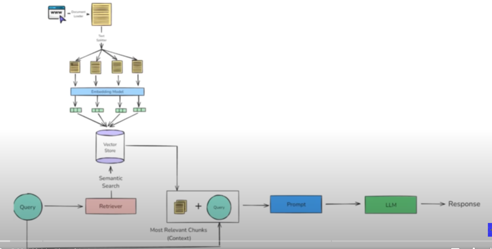

# 📺 YouTubeBuddy

> **An intelligent assistant to query and summarize YouTube videos without watching them in full.**

---

## 🚀 Need

Many users struggle with long video content and can’t always find specific information easily.  
YouTube lacks an easy way to ask questions or summarize videos without watching them entirely.  
YouTubeBuddy solves this by letting you:

✅ Ask questions about the video  
✅ Get direct, context-aware answers  
✅ Generate concise summaries

---

## ⚙️ Technology Used

- 🛠️ **LangChain** for building conversational chains  
- 🧭 **FAISS** for vector search on transcript chunks  
- 🤖 **OpenAI / Google Gemini APIs** for natural language understanding  
- 🎥 **YouTube Transcript API** to fetch video subtitles  
- 🌐 **Streamlit** for a simple, interactive frontend

---

## ✨ Key Features

- Ask any question related to a YouTube video
- Get instant answers from video content
- Summarize lengthy videos into short notes

---

## 🏗️ Architecture

---

## 🚀 Future Enhancements

### UI based improvements
- Duration & summary length controls
- Better context highlighting

### Retrieval improvements
- Enhanced chunking strategies
- Use more advanced embedding models

### Augmentation
- Integrate metadata like chapters & tags
- Context-aware summarization

### Generation
- Robust multi-hop question answering
- Enhanced citations & references

### System Design
- Move to microservices for scalability
- Logging, monitoring & tracing

---

## 🤝 Contributing

Contributions, issues and feature requests are welcome!  
Feel free to open an [issue](https://github.com/yourusername/YouTubeBuddy/issues) or submit a pull request.

---

## 📄 License

Distributed under the MIT License.  
See [`LICENSE`](LICENSE) for more information.

---

⭐ If you like this project, give it a star! ⭐

---

